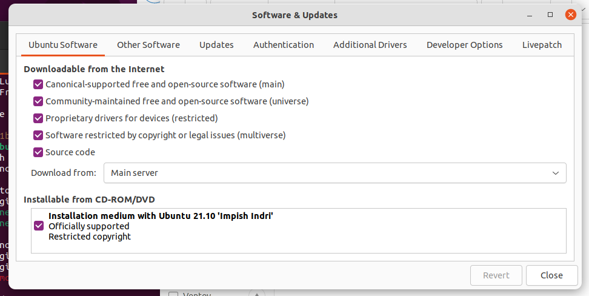
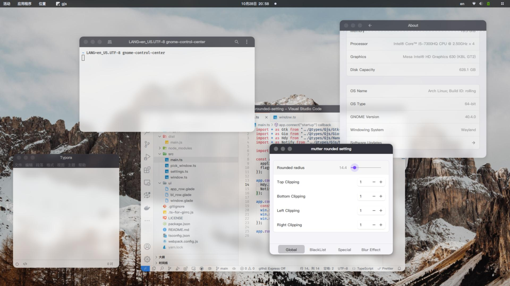
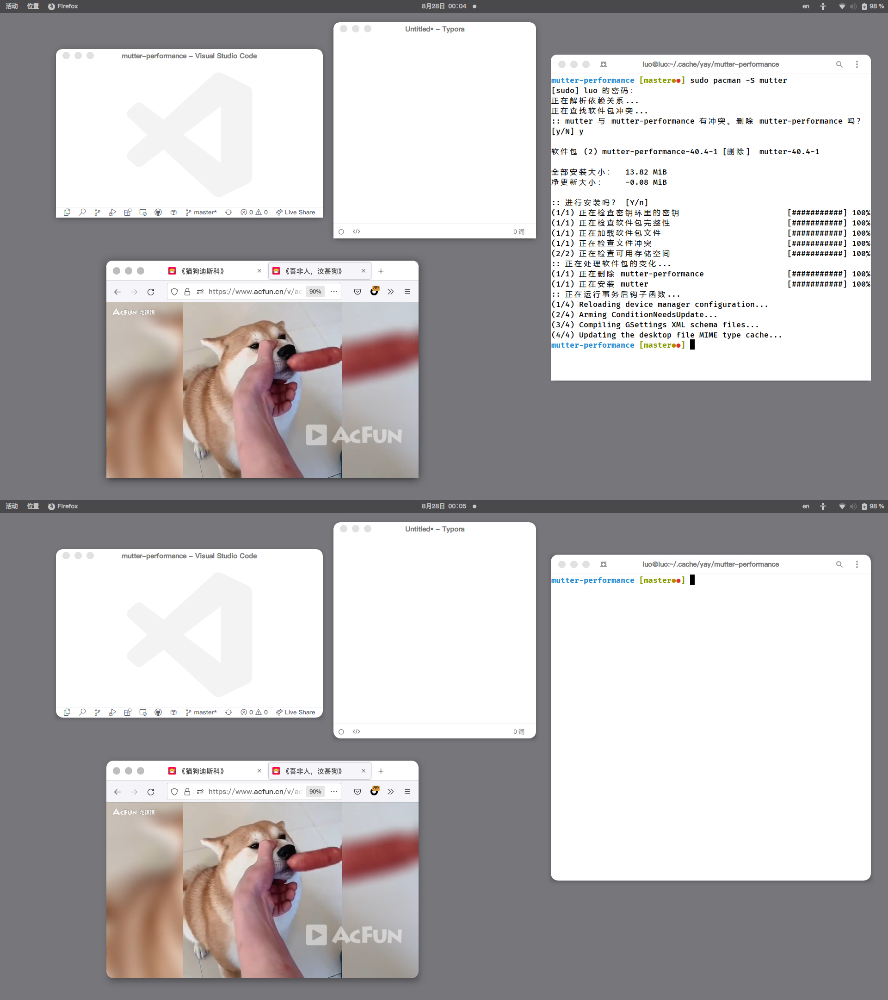
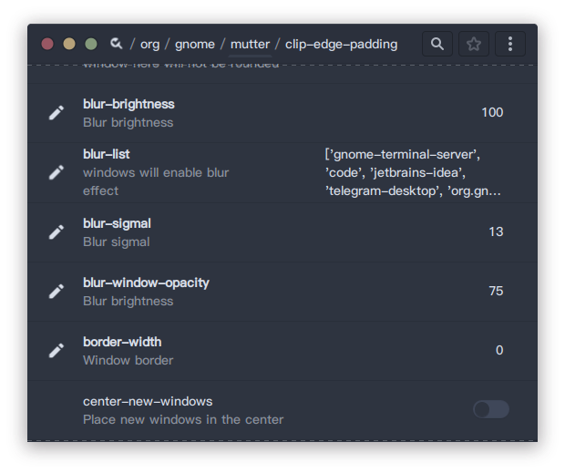
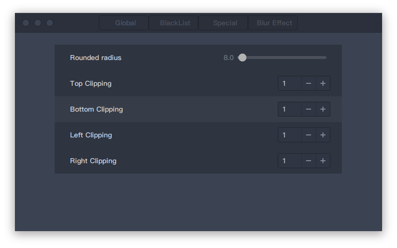

Tested in gnome-shell 40.5, should works in gnome 40 and 41.

integrate the blur effects with rounded corners.The source code can be found [here](https://github.com/yilozt/mutter).

__Issues__:

- It can be buggy with blur effect. see [https://github.com/aunetx/blur-my-shell](https://github.com/aunetx/blur-my-shell). If you are using Intel driver in Xorg session, try create `.drirc` in your home directory to disable Vertical Synchronization: 
  ```xml
  <device screen="0" driver="dri2">
      <application name="Default">
          <option name="vblank_mode" value="0"/>
      </application>
  </device>
  ```
  ## For Nvidia and AUR
  - you need to do makepkg --nocheck -si or it will fail the checks at the end.

- The original shadows of rounded windows has been cutted out, now use `MetaShadowFactroy` to draw shadows for rounded windows. So the animation effect of shadows in some themes has gone. 

# Install

## Arch Linux

install `mutter-rounded` by AUR helper:

```bash
yay -S mutter-rounded
```

## Ubuntu 21.10 / Ubuntu 22.04

There is a simple script to help you build the packages in ubuntu 21.10. It's neccesary to check the content of script. Before you build the packages, the `Source code` checkbox in `Software & Updates` should be enabled:



```bash
git clone https://github.com/yilozt/mutter-rounded
cd ./mutter-rounded/ubuntu
./package.sh

# Ubuntu 21.10
sudo dpkg -i libmutter-8-0*.deb mutter-common*.deb

# Ubuntu 22.04
sudo dpkg -i libmutter-10-0*.deb mutter-common*.deb
```

## Fedora 35 / Fedora 36

There are pre-build packages which built by [@gregor160300](https://github.com/gregor160300), you can download packages from [https://gregor160300.stackstorage.com/s/I4YFXu82ay6mNE0C/en_US](https://gregor160300.stackstorage.com/s/I4YFXu82ay6mNE0C/en_US).

Alternatively, you can build packages by yourself with scripts in `fedora` folder. It's neccesary to check the contents in scripts before you run it.

```bash
git clone https://github.com/yilozt/mutter-rounded
cd ./mutter-rounded/fedora
./package.sh
```

After scripts finish, the rpm packages will be found in `~/rpmbuild/RPMS/x86_64/`:

```
cd ~/rpmbuild/RPMS/x86_64/
sudo dnf upgrade mutter
sudo rpm --reinstall mutter-42.*
```

# Uninstall

When you want to remove this patch from your system, just need to install `mutter` package from official repo.
The rounded corners will gone when you login into gnome-shell in next time.

- Arch Linux

```
sudo pacman -S mutter
```

- Ubuntu

```bash
# Ubuntu 21.10
sudo apt install libmutter-8-0 mutter-common

# Ubuntu 22.04
sudo apt install libmutter-10-0 mutter-common
```

- Fedora

```
sudo dnf reinstall mutter
```

# Screenshots




# Settings

The settings of mutter have driven by GSettings, so you can set config by:

- via `gsettings`:
  ```
  $ gsettings get org.gnome.mutter round-corners-radius 
  14
  $ gsettings set org.gnome.mutter round-corners-radius 8
  ```

- via `dconf-editor`, the settings are located in `/org/gnome/mutter`:
  

- via [mutter_setting](https://github.com/yilozt/mutter-rounded-setting), a simple gui written by Gjs.
  
